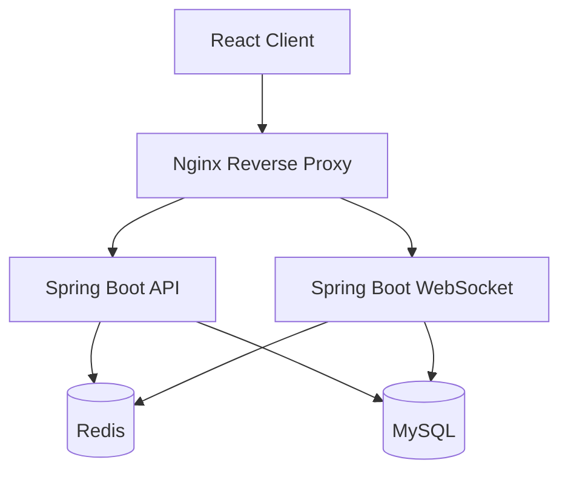
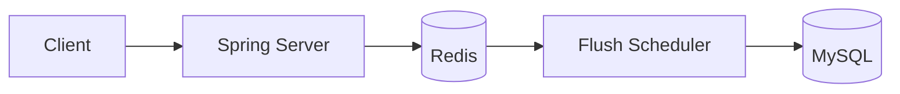
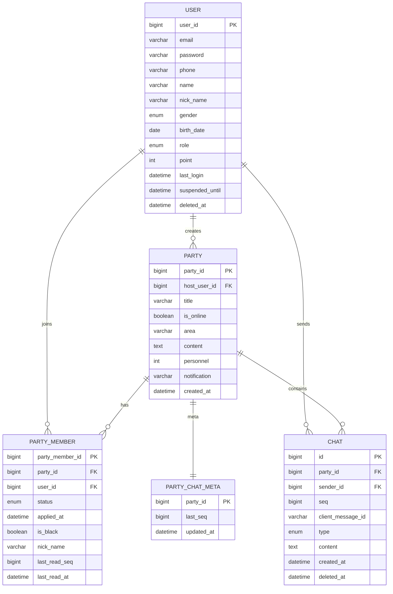
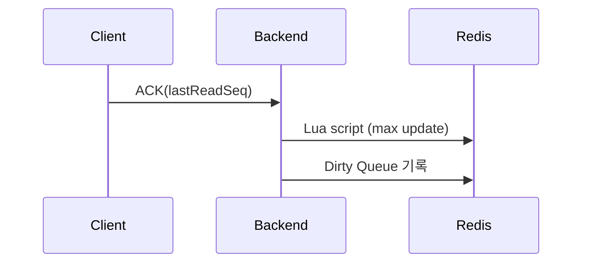
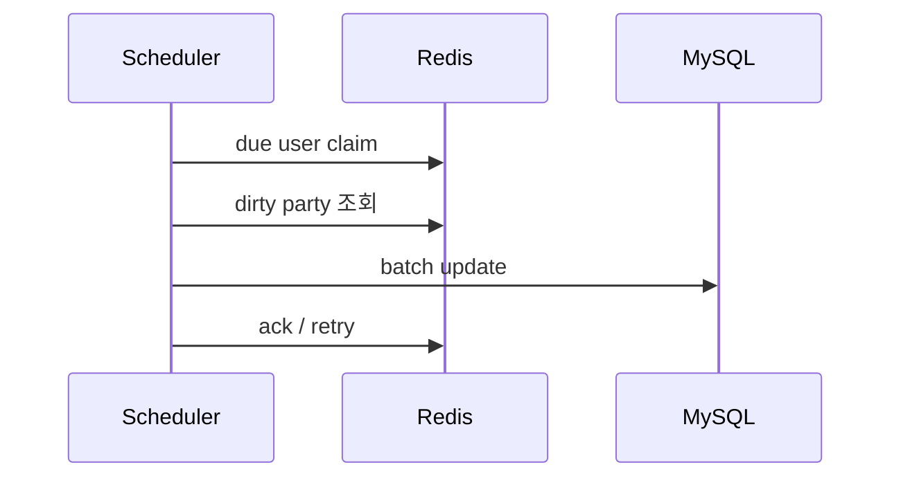

# 🧩 New-LetsAssemble
### 그룹 매칭 플랫폼 백엔드

> 그룹 생성, 참가 신청, 승인/거절 관리 및
> Redis 기반 채팅 읽음 처리 시스템을 포함한 백엔드 서버

---

# 📌 프로젝트 소개

이 프로젝트는 단순 기능 구현을 넘어
**도메인 불변성과 데이터 정합성 유지**를 중심으로 설계하였다.

또한 실제 서비스 환경에서 발생할 수 있는 문제를 해결하는 것을 목표로 구현하였다.

설계 목표

- 상태 전이(State Transition) 기반 도메인 설계
- 동시성 환경에서 인원 제한 불변성 보장
- Redis 기반 채팅 읽음 처리 시스템 구현
- 멀티 인스턴스 환경 메시지 순서 관리
- Redis 기반 캐시 전략을 통한 데이터베이스 부하 감소
- 시간 의존 로직 테스트 가능성 확보
- JWT 기반 인증 및 세션 관리

---

# 📌 주요 기능

- 파티 생성 및 참가 신청
- PartyMember 상태 전이 기반 그룹 관리
- Redis INCR 기반 메시지 순서 관리
- Redis 기반 채팅 읽음 처리
- Dirty Queue 기반 읽음 정보 지연 반영 (Deferred Flush)
- Scheduler 기반 Batch DB Flush
- Redis Recent Cache 기반 채팅 조회 최적화
- JWT 기반 인증
- Device 기반 세션 관리

---

# 📊 시스템 아키텍처



Spring Boot 애플리케이션은
API 서버와 WebSocket 서버 역할을 동시에 수행하도록 구성하였다.

---

# 🧭 채팅 읽음 처리 시스템 아키텍처

채팅 읽음 처리 시스템은 **Redis 기반 Dirty Queue 구조**로 설계하였다.

목표

- read ack 트래픽을 DB에서 Redis로 분산
- DB update를 batch 처리
- 단조 증가(last_read_seq) 불변성 보장



---

# ❓ Why Redis

채팅 시스템에서 **읽음 처리(read ack)** 는 매우 빈번하게 발생한다.

모든 read ack 요청을 DB에 직접 반영할 경우

- 높은 write 트래픽 발생
- DB 부하 증가
- 성능 저하

이를 해결하기 위해 다음 구조를 사용하였다.

```
Read ACK
   ↓
Redis 즉시 반영
   ↓
Dirty Queue 기록
   ↓
Scheduler Batch Flush
   ↓
DB 업데이트
```

이 구조를 통해 **DB write 트래픽을 크게 줄일 수 있다.**  

또한 Redis는 단일 스레드 기반으로 동작하기 때문에  
INCR 같은 연산을 원자적으로 수행할 수 있다.

따라서 메시지 순서 관리에 적합하다.

---

# 📂 프로젝트 구조
```
src/main/java/com/pr1/newletsassemble

auth
├─ api
├─ application
└─ infra

party
├─ domain
└─ infra

chat
├─ api
├─ application
│  ├─ port
│  └─ scheduler
├─ domain
└─ infra

user
├─ api
├─ domain
└─ infra

global
├─ config
├─ security
└─ time
```

---

# 🗄 데이터베이스 설계 (ERD)



---

# 🧱 기술 스택

Backend

- Java 17
- Spring Boot
- Spring Security (JWT)
- WebSocket + STOMP
- JPA (Hibernate)

Data

- MySQL
- Redis
  - INCR
  - ZSET
  - SET
  - LIST

Infra

- Docker
- Nginx
- AWS EC2

---

# 🏛 아키텍처

Layered Architecture 기반으로 설계하였다.

```
Presentation
↓
Application
↓
Domain
↓
Infrastructure
```

---

# 🔄 PartyMember 상태 전이

```
APPLIED → APPROVED
APPLIED → REJECTED
APPLIED → CANCELED
APPROVED → KICKED
```

설계 원칙

- 실제 그룹 인원 수는 APPROVED 상태만 포함
- 상태 변경은 트랜잭션 내에서 수행
- 인원 검증과 상태 변경을 동일 트랜잭션에서 처리

---

# ⚙️ 동시성 문제 해결

파티 인원 제한 기능에서는 동시에 여러 사용자가
참가 요청을 보낼 경우 정원 초과 문제가 발생할 수 있다.

예를 들어 정원이 5명인 파티에 동시에 여러 사용자가
승인 처리될 경우 실제 인원보다 더 많은 사용자가
참가할 수 있는 문제가 발생할 수 있다.

이를 해결하기 위해 다음과 같은 설계를 적용하였다.

- 상태 전이(State Transition) 기반 도메인 모델 적용
- 트랜잭션 내 인원 검증
- APPROVED 상태 기준 인원 계산

이를 통해 동시성 환경에서도
파티 인원 제한 불변성을 유지하도록 설계하였다.

---

# 💬 채팅 읽음 처리 시스템

채팅 읽음 처리는 **Redis 기반 비동기 flush 구조**로 구현하였다.

핵심 아이디어

- read ack → Redis 즉시 반영
- Dirty Queue 기록
- Scheduler가 DB batch flush

이를 통해 **읽음 처리 트래픽을 Redis로 흡수하고 DB 부하를 줄였다.**

---

# 1️⃣ Read ACK 처리 흐름



---

# 2️⃣ Dirty Queue Flush 흐름



---

# 🔢 메시지 순서 관리

채팅 메시지는 Party 단위 순서를 유지해야 한다.

이를 위해 Redis INCR을 사용하여
**Party 단위 메시지 seq를 생성한다.**

장점

- 멀티 인스턴스 환경에서도 충돌 없는 seq 생성
- 채팅 메시지 순서 보장

---

# 📦 채팅 캐시 전략 (Recent Cache)

채팅방 진입 시 성능을 위해
최근 메시지를 Redis에 캐싱하였다.

목표

- 채팅방 진입 시 DB 조회 감소
- 최근 메시지 빠른 조회

전략

- 최근 N개의 메시지를 Redis List로 유지하고 LTRIM을 사용하여 캐시 크기를 제한한다.
- 메시지 저장 시 Redis cache 갱신
- 채팅방 진입 시 Redis cache 조회
- 캐시에 없는 메시지는 DB에서 조회

구조

```
Redis List

key : party:{partyId}:recent
```

처리 흐름

```
메시지 저장
   ↓
Redis Recent Cache push
   ↓
최근 N개 유지 (LTRIM)

채팅방 진입
   ↓
Redis cache 조회
   ↓
부족한 메시지는 DB 조회
```

Redis 캐시는 채팅방 최초 진입 시 빠른 메시지 조회를 위해 사용된다.

cache miss가 발생할 경우 DB 조회로 처리한다.

---

# 📖 채팅 읽음 처리

읽음 상태는 두 값으로 계산한다.

last_seq
채팅방 기준 마지막 메시지 seq

last_read_seq
사용자가 마지막으로 읽은 메시지 seq

안 읽은 메시지 수

```
unread = last_seq - last_read_seq
```

---

# 🧰 Redis 데이터 구조

### 메시지 sequence 관리

```
chat:party:last_seq:{partyId}
```

Party 단위 메시지 seq 관리

---

### 사용자 읽음 위치

```
chat:user:read_seq:{userId}
```

ZSET 구조

score = last_read_seq
member = partyId

이를 통해 한 사용자 기준 여러 채팅방의 읽음 위치를
효율적으로 관리할 수 있으며

unread count 계산을
last_seq - last_read_seq 방식으로 처리할 수 있다.

---

### Dirty Queue

```
chat:dirty:users
chat:dirty:processing
chat:dirty:user:{userId}
```

역할

- flush 대상 user 관리
- user별 dirty party 관리
- flush retry 관리

Dirty Queue는 동일 사용자가 여러 번 read ack를 보내더라도
flush 대상 사용자로 한 번만 등록되도록 관리한다.

이를 통해 동일 사용자에 대한 중복 DB flush 작업을 방지한다.

---

# 🔐 보안 설계

JWT 기반 인증

Access Token
API 인증

Refresh Token
Access Token 재발급

Refresh Token 사용 시 새로운 Refresh Token을 발급하여
토큰 재사용 공격(Replay Attack)을 방지하였다.

---

# 📱 Device 기반 세션 관리

JWT는 Stateless 구조이기 때문에
토큰 유출 시 만료 전까지 재사용될 수 있다.

이를 보완하기 위해
디바이스 기반 세션 식별자를 사용하였다.

헤더

```
X-LA-Device-Id
```

기능

- 멀티 디바이스 로그인 지원
- 디바이스 단위 로그아웃
- Refresh Token 재사용 방지

---

# 🌐 배포 구조

Docker Compose 기반 단일 EC2 배포

구성

- Nginx
- Spring Boot
- Redis
- MySQL

---

# 🧪 테스트 전략

- UseCase 단위 테스트
- 그룹 승인 동시성 테스트
- Redis INCR 원자성 검증
- 채팅 읽음 처리 흐름 테스트

---

# 📈 개선 가능 사항

- 채팅 메시지 전송 시스템 구현
- 채팅 서버와 API 서버 분리
- Cursor 기반 채팅 조회
- client_message_id 기반 메시지 중복 방지(idempotency) 처리
- Redis 캐시 정책 최적화
- 부하 테스트 기반 병목 분석

---

# 👨‍💻 개발자

신현기
Backend Developer

---

⭐ 개인 학습 및 포트폴리오 목적으로 개발된 프로젝트입니다.
