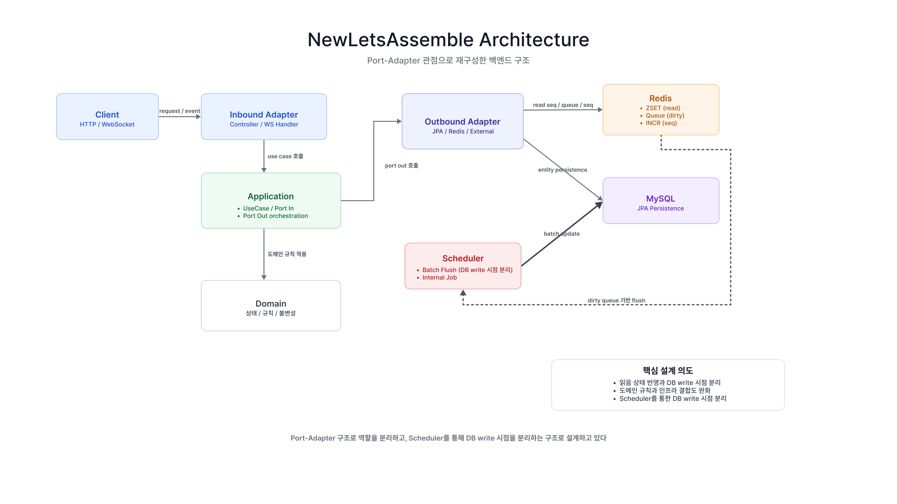
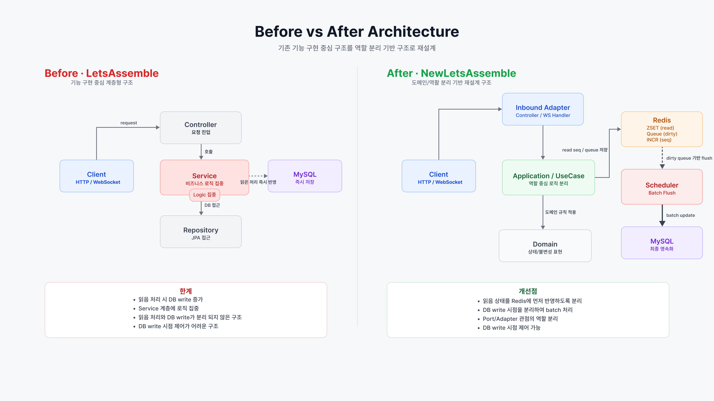
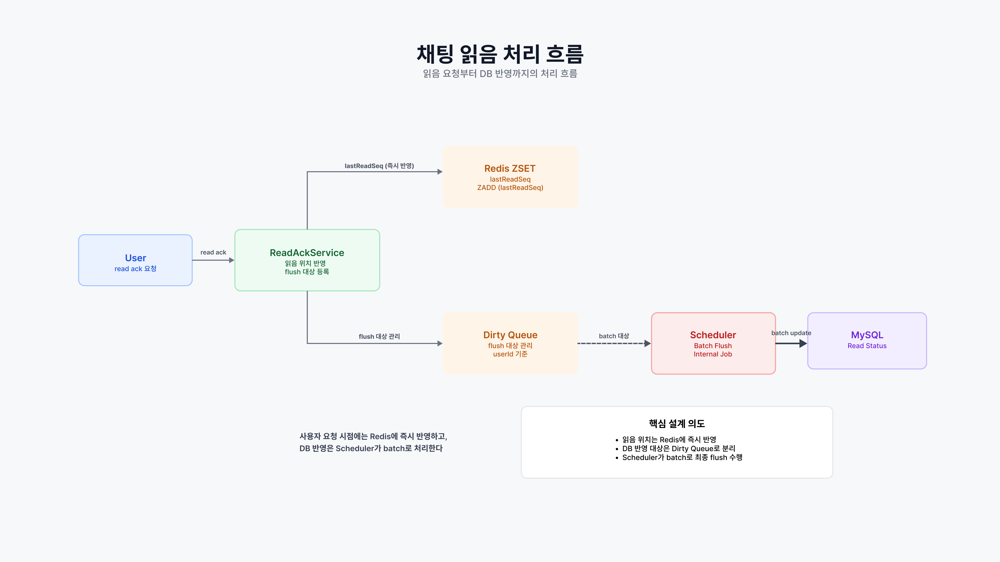

# 🧩 NewLetsAssemble
### 그룹 매칭 플랫폼 백엔드 재구성 프로젝트

> 기존 팀 프로젝트를 바탕으로
> 채팅 읽음 처리와 인증/세션 구조를 중심으로 재구성하고 있는
> 백엔드 프로젝트 (진행 중)

---

## 📌 핵심 문제 및 접근 방식

이 프로젝트는 채팅 시스템에서 발생하는
**읽음 처리 DB write 집중 구조를 완화하기 위해 시작되었습니다.**

기존 구조에서는 사용자의 읽음 이벤트마다 DB update가 발생하여
동시 요청이 증가할 경우 write 부하가 집중되는 문제가 있었습니다.

현재는 읽음 상태를 Redis에 먼저 반영하고,
Dirty Queue와 Scheduler를 통해 DB에 반영하는 구조로 분리하고 있습니다.

읽음 요청은 빈도가 높고 최종 read seq만 중요하기 때문에,
요청마다 DB에 즉시 반영하지 않고 Redis를 중간 저장소로 사용했습니다.

이를 통해 요청 처리 흐름과 DB 반영 시점을 분리하는 방향으로 구조를 재구성하고 있습니다.

---

## 📌 프로젝트 개요

NewLetsAssemble은 기존 프론트엔드와 백엔드가 함께 구성된 프로젝트를 기반으로,
백엔드 구조를 분리하고 처리 흐름 중심으로 다시 구성하고 있는 프로젝트입니다.

기존 프로젝트는 기능 구현 중심의 구조였으며,
채팅과 같이 트래픽이 집중되는 영역에서 처리 흐름이 분리되어 있지 않았습니다.

현재 프로젝트에서는 다음 영역을 중심으로 구조를 재구성하고 있습니다.

- 채팅 읽음 처리 구조 분리
- unread 계산 캐시 구조 구성
- Scheduler 기반 DB flush
- JWT 기반 인증 및 세션 관리

---

## 🎯 진행 목적

- 읽음 요청이 DB write로 직접 연결되는 구조 완화
- Redis 기반 상태 저장 및 지연 반영 구조 구성
- 인증과 세션 상태 분리
- 동시 요청 환경에서 정합성을 유지할 수 있도록 설계

---

## 🧱 기술 스택

### Backend
- Java 17
- Spring Boot
- Spring Security
- Spring Data JPA

### Communication
- REST API
- WebSocket
- STOMP
- Redis Pub/Sub

### Data
- MySQL
- Redis

### 개발 환경
- Docker

> Docker는 현재 개발 환경에서 Redis와 MySQL 실행 용도로 사용하고 있습니다.
> Redis는 읽음 처리, unread 캐시, 세션 관리, 토큰 처리에 역할별로 사용하고 있습니다.
---

## 🏛 프로젝트 구조

```text
api           : REST / STOMP 진입점
application   : 서비스, 유스케이스, 스케줄러
domain        : 도메인 모델과 정책
infra         : Redis, JPA, JDBC, WebSocket, Security 구현
```

---

## ⚠️ 문제 상황 : 읽음 처리 DB write 집중

기존 구조에서는

- 읽음 이벤트마다 DB update 발생
- 요청 수만큼 write 증가
- 트래픽 증가 시 DB 부하 집중

---

## 🔧 현재 구조

### 1. Redis 기반 읽음 처리

- read seq를 Redis에 저장
- DB에는 즉시 반영하지 않음

### 2. Dirty Queue

- 변경된 사용자/파티를 Redis 기반 queue 구조로 관리
- 중복 flush를 줄이고 retry 가능한 형태로 처리

### 3. Scheduler 기반 DB 반영

- Redis 데이터를 batch로 DB에 반영

- 읽음 상태는 더 큰 seq만 반영하도록 처리
- flush 과정에는 lock과 retry 흐름을 적용

---

## 📌 전체 아키텍처



---

## 📌 구조 변화 (Before / After)



---

## 📌 채팅 읽음 처리 흐름



---

## 📊 채팅 처리 흐름

### 메시지 처리 구조
- Redis sequence 기반 메시지 순서 관리 구조를 적용
- Redis Pub/Sub 기반 전달 구조를 구성 중
- 실제 메시지 송신 유스케이스는 계속 연결 중

### 읽음 처리
- Redis read seq 업데이트
- Dirty Queue 등록
- Scheduler flush

---

## 📊 unread 계산 구조

- fresh / stale cache 분리
- leader lock 기반 중복 계산 방지
- stale cache를 fallback으로 사용
- Redis HASH 기반 summary 관리

---

## 🧰 Redis 사용 구조

### STRING
- seq, lock, token version, refresh token, session

### SET
- 파티 멤버 캐시
- dirty user party 목록

### ZSET
- read seq (사용자별 마지막 읽음 위치)
- dirty queue scheduling 및 flush 대상 관리

### HASH
- unread summary

### LIST
- 최근 채팅 캐시

### Lua Script
- read seq max update
- dirty queue 처리
- unread swap
- token rotate

---

## 🔐 인증 및 세션 관리

### JWT 인증
- Access / Refresh Token 구조
- 인증과 세션 상태를 분리하기 위해 JWT 기반 인증 구조 적용

### Refresh Token Rotation
- 기존 토큰 비교 후 교체

### Token Version
- 전체 로그아웃 시 무효화

### 세션 관리
- Redis와 DB를 함께 사용한 활성 세션 관리
- deviceKey / sessionId 기준 세션 추적

---

## 🚧 현재 상태

### 구현된 주요 구조
- Redis 기반 읽음 처리 구조
- Dirty Queue + Scheduler flush
- 인증 / 세션 관리 구조

### 진행 중
- 채팅 메시지 송신 흐름
- WebSocket 처리 확장

---

## 📚 구현하며 집중한 부분

- 요청 처리와 DB 반영 시점 분리
- Redis 자료구조 역할 분리
- 원자성 및 정합성 유지
- 인증과 세션 분리 구조

---

## 📝 참고

- 구조 개선 과정 중심 프로젝트
- 일부 기능은 지속적으로 보완 중
